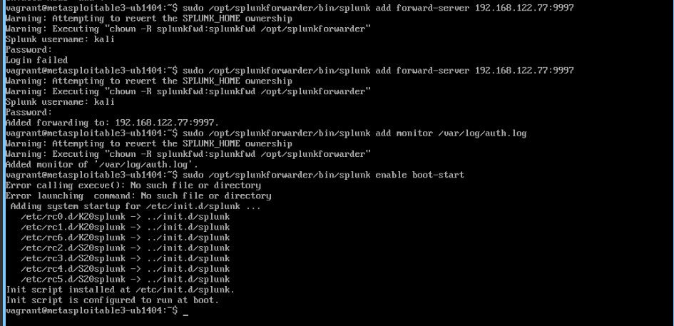
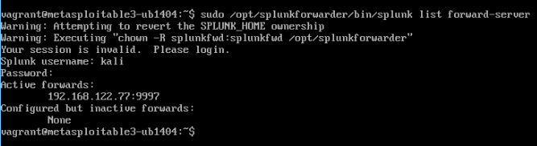
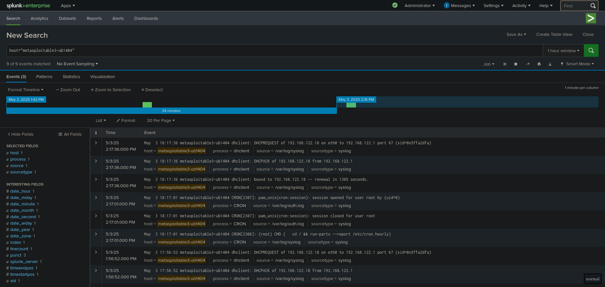
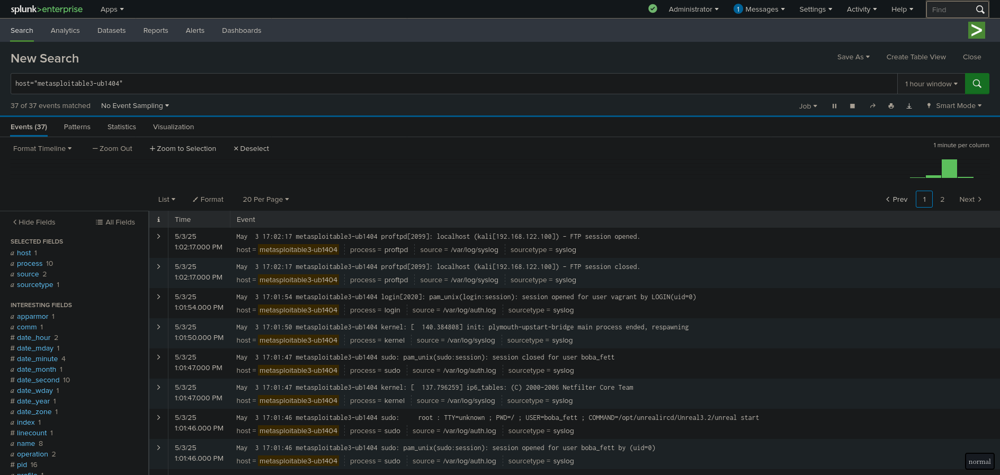

* Phase 2
** Splunk Forwarder 

Configuring splunk forwarder on victim

Splunk forwarder status

** Splunk

Before exploit

After exploit

We can see from the logs that an FTP connection has been made.
That FTP connection is used to transfer the PHP payload using anonymous login.
